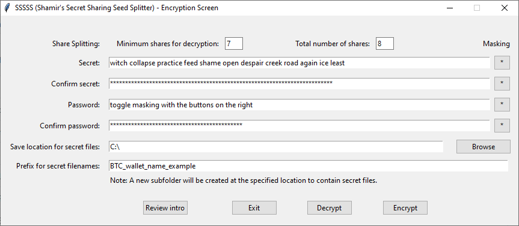
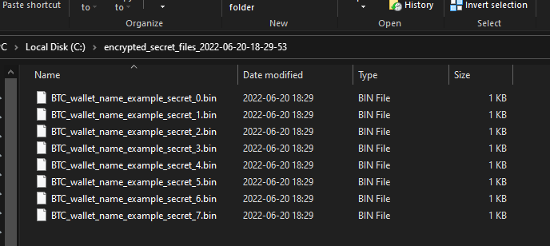
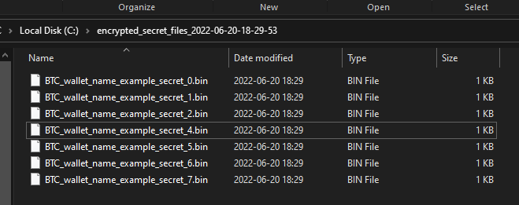
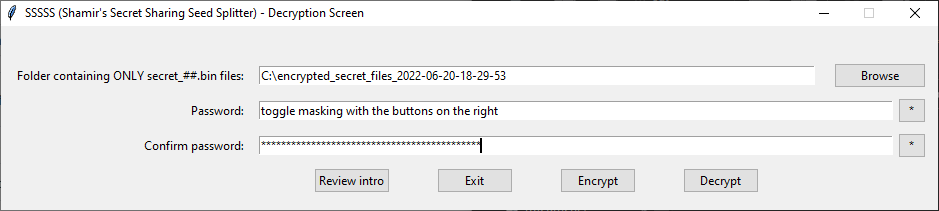
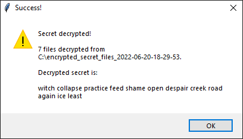

# SSSSS - Shamir's Secret Sharing Seed Splitter  
  
## TLDR  
  
#### Not your keys, not your coins. Conversely, no keys, no coins! Don't lose your keys! Spread your seed!  
  
Uses SSS and a password to create encrypted files, only useful for decryption if the minimum shares (defined by you in the encryption step) is available, along with your password.  
  
#### This software is currently in ALHPA, testing is welcome, but at this stage, I do not recommend using this as your ONLY means of seed backup at this time. BUT please feel free to download and test it out, if you don't trust it, read the code or put in made up stuff to see how it works and let me know what you like and don't like!  
  
## Pitch
  
**20-50% of bitcoin is expected to be permanently lost**  
  
This is largely because the seed phrases are protected so well by their owners. Typically, a single copy (physical or digital) is kept, for security reasons; whether it's written down, stamped in metal, stored on a flash drive or hard drive. You can forget where it is, lose it in a fire, or some other catastrophic event; essentially, the seed becomes lost, corrupted or destroyed.  
  
We have gotten accustommed to centralized support that offers a *Forgot password?* feature, which does not exist in the self custody wallet universe. Some examples below, and **read on to see how this software can help mitigate against this happening to you.**  
  
<https://fortune.com/2017/11/25/lost-bitcoins/>  
<https://decrypt.co/37171/lost-bitcoin-3-7-million-bitcoin-are-probably-gone-forever>  
<https://www.nytimes.com/2021/01/12/technology/bitcoin-passwords-wallets-fortunes.html>  
(Just google "lost bitcoin")  
  
## Aims  
  
\* Minimize the risk of losing your seed phrase - eliminates single point of failure of the seed phrase through SSS  
*(some links on what SSS is are listed below)*  
  
\* Keep your seed phrase secure - uses password to encrypt distributed SSS shares  
*(distribution strategy is up to the user - cloud services, flash drives, local drives, basically any data storage medium)*  
  
\* Easy encryption and decryption for recovery - use the software to one-step split and encrypt and one-step recombine and decrypt the shares  
  
## Advantages of using this software  
  
\* Much lower risk of permanently losing your seed phrase.  
\* Universal support for SSS with any wallet's seed phrase.  
  
## Simple language overview   
  
1) Turns your seed phrase into a number by encoding (not encryption), then uses Shamir's Secret Sharing to create shares from that number. See <https://en.wikipedia.org/wiki/Shamir%27s_Secret_Sharing> for more on how this part works.  
  
2) These shares are then encrypted with your password and saved as files.  
  
3) You can now distribute these files in other **secure** locations, such as multiple different 2FA protected cloud storage (so that the files are separate, and the points are not saved together; so if someone hacked a particular cloud storage, they only get one point, and still cannot get your seed phrase.)  
  
4) Note that even if someone were to get a file, they would still need the password you encrypted them with, and even then, a single file cannot reveal your seed phrase (as long as you specified more than 1 as the minimum number on the software's encrypt screen.)  
  
5) In the future, if you need to recover your seed phrase, collect the minimum number of files from wherever you distributed them, place them in a folder, and decrypt them using the software and your password.    
  
## Pricing?
  
This software is **open source and free to use**. See License file or refer to (GPLv3) for more information on terms of use. However, please consider donating :) <https://github.com/winterpetrichor/SSSSS/blob/main/modules/donate.md>  
  
**Why free and open source?**  
  
1) **Free** - This kind of protection should be free and available to anyone who wants to secure their assets via self custody but, like me, not worry too much about losing their seed phrase, and thereby, all access to your assets.  
  
2) **Open source** - The information this software deals with is obviously very sensitive. The code is open source for all to see that there is no malicious code included, nothing is saved except for the files you create. You could run this offline, in a virtual machine, with an immutable hard disk and everything would work absolutely fine. Of course, that couldn't protect you from some kind of intercept device like a keylogger that would save your keystrokes as you typed your seed phrase, or password. Also, I am not a professional developer, nor a specialist in cryptography, and the initial code was developed in complete isolation. If it turns out that I missed something or I'm completely mistaken on how these things work, this was a fun project to work on. If it does work and make sense, I hope it drives adoption of more practical security, even if that renders this project obsolete.  
  
Anywho, firstly, and no matter what, I hope that the software brings you value. You might however, notice that I'm asking for donations; I did spend time learning about all this, and writing the software. I also intend to maintain and continue improving it (feedback is welcome, especially clear, constructive criticism.) Again, I hope that the software brings value to you, regardless of whether you donate or not.  
  
If you do choose to donate, I thank you sincerely for appreciating the time and effort that went into this. As of right now, all donations will go toward funding my efforts on this software, helping me to improve it, perhaps write other useful software, and also, to become a better developer in general.  
  
As stated before, I am not a professional developer. While I would like to be, I have financial responsibilities that require me to maintain my full time job. However, I am interested in making the transition into software; please reach out to me with some details if you have an offer. That being said, this is my first published software project. I chose this project because it is something I'm interested in, and I think this is a niche that needs to be filled. If there are any bugs, oversights, etc., especially with regard to cryptography, or fundamental assumptions on how these things work, please let me know and I will have them addressed as soon as I can. I am interested in learning what I can to make myself better in this space.  
  
## A few things you should know before using this software  
  
\* You should consider a few relatively secure cloud file storage solutions, the files are very small, so free tiers will be fine, and easy to set up. Microsoft OneDrive, Google Drive and Dropbox are good candidates.  
\* You will need to locate and download these files if you are going to restore your seed at a later date, so you'll want to store them in a logical place where you'd think to look for them.  
\* A password manager is generally recommended for passwords, but can represent a single point of failure, which we are trying to avoid.  
  
## More about the application  
  
The intent of this application is to allow your seed phrase to be easily and readily available to you, in a practical manner. It will encode and then split your seed phrase into shares, and encrypt your seed phrase with your password, so that it can be distributed among cloud services and/or local data storage methods, and will always be easily accessible. You can decrypt with your password once you can recover the minimum number of shares (set by you).  
  
In short, the software makes it signficantly easier for you to recover your seed phrase, with only a marginal decrease in security.  
  
The software does this by using 1) a password, and 2) a programatically generated encryption key, to encrypt the seed phrase of a digital wallet so that its parts can be distributed in multiple, varying digital locations (e.g. multiple cloud storage services) to mitigate against the risk of losing access to physical copies of SSS shares or otherwise trying to secure the entire (complete or unencrypted) seed phrase in a cloud service, which has inherent risk.  
  
You will need 1) your secret (seed phrase or other text you wish to obfuscate), and 2) a password, (ideally a strong one, that you can memorize, or one stored in a password manager that is not linked to your shares in any way, but keep in mind the password manager can represent a single point of failure. Losing access to the password within it, may render you unable to access your seed.)  
  
This password will be used to symmetrically encrypt your data with Fernet encryption provided by the cryptography library.  
https://pypi.org/project/cryptography/  
  
The software is intended to be used to encrypt and then split your secret in a manner that would allow you to use X number of Y total shares to reconstruct your secret. You may set X = Y when using if you would prefer to have a system where all shares are required before decryption.  
  
**You** and **only you** are responsible for the strength of your password, the accuracy of the secrets and passwords entered, and the security of your share files generated. I do not claim that that is foolproof or unhackable, but it is designed to be a reasonably secure method, if implemented correctly, and with a bit of luck.  
I thereby wish you good luck!  
  
## Some background information  
  
### How the software works  
  
1) Your secret data is re-encoded as an integer  
2) The secret is split into shares using SSS  
3) The shares are encrypted by your password and can by decrypted by the same password  
  
#### Notes:  
  
a) This might sound like any one share, once recovered, can reveal a part of your secret, however, all this will reveal is an integer pair that cannot be decoded further without other shares to satisfy the minimum number of SSS points required to discover the actual obfuscated integer requried to decode your secret.  
  
b) Symmetric encryption as opposed to asymmetric encryption was chosen for a couple reasons:  
  
\* Using asymmetric encryption creates a key file, which would be required for decryption, during initial development, the thinking was that this file would represent a culmination of the risk mitigated by implementing SSS, whereby a single point of failure (this key file) could render your seed phrase inaccessible. While one could argue that a password represents a similar single point of failure, strong passwords may be user generated to replace the seed phrase, while a seed phrase is predetermined, making the user more likely to recall the password.  
  
\* Passwords in this case can also represent a separate factor in the authentication process compared to the secret files generated by the software, whereas a key is likely also a file.  
  
\* I acknowledge that the lines are a little blurred here. At the time of writing, I'm considering implementing TOTP and asymmetric encryption options, however, thinking this through in the practical use case is critical. Since the major objective of the software, is the ease of recovering the seed phrase, without increasing the points of failure. It can also be argued that you can be more cavalier with the password used in this software than with your seed, since it's useless without the secret files. You can think of the password as a master share.  
  
**Shamir's Secret Sharing (SSS)**   
<https://en.wikipedia.org/wiki/Shamir%27s_Secret_Sharing>  
<https://www.cs.purdue.edu/homes/hmaji/teaching/Fall%202020/lectures/08.pdf>  
<https://www.cs.purdue.edu/homes/hmaji/teaching/Fall%202020/lectures/09.pdf>  
The use of SSS in this project is, as it would be in any project, twofold.  
1) To cater for a number of shares becoming inaccessible (lost cloud account, data storage device destroyed in a fire, etc.).  
2) So that no one share contains the entire secret, enhancing security.  
  
As far as I know, at the time of writing, only Trezor has implemented SSS via SLIP39 <https://github.com/BlockchainCommons/bc-slip39>, which directly converts your binary seed into seed phrase shares for the Shamir Backup (SSS). This is a better approach, than the one taken here, and one I hope to see as a standard in wallets going forward. However, adoption will take time, so a completely different approach is taken in this software. Whatever wallet you choose, presumably any wallet other than the Trezor Model T, will still convert your binary seed into a single seed phrase, which can then be used with this software to create the encrypted shares.  
  
**Fernet Encryption**  
<https://cryptography.io/en/latest/fernet/>  
This is used to implement symmetric encryption on the shares generated.  
  
**Symmetric Encryption**  
<https://www.ssl2buy.com/wiki/symmetric-vs-asymmetric-encryption-what-are-differences>  
*(See note 'b' above)*
  
### Some general tips  
  
\* Store your secret files safely and in different, relatively secure digital locations such as different cloud services that use at least 2FA to allow access.  
  
\* Data degradation on physical hardware is real; consider keeping multiple copies (still separately) or also using another backup method for your secret or seed phrase, such as mnemonics, paper steel, etc.  
  
\* This method is only meant to provide you with easier, more reliable alternative access to your secret compared to finding your physical records or collecting digital\physical shares from other individuals or locations.  
  
## Using the software  
  
### Encrypt screen  
  
1) Enter the minimum number of shares and total number of shares, your secret, password, save location and secret filename prefix.  
  
    
2) Click Encrypt.  
  
3) The software will encode and split your secret then encrypt the files using your password and save them in the folder you chose, with the filename prefix you specified. (This step is very fast)  
  
  
4) The software will then use the minimum number and total number of shares to generate a list (of lists) of all possible combinations (n choose k) of the secret files, which will then be tested using the decryption step, to verify the files have been correctly encrypted, and that your secret is recoverable with any combination of the **minimum** number of these files. Minimum is highlighted here, because in the testing done during initial development, in some (rare) cases, even though decryption using any combination of the minimum number of files worked, sometimes, using more than the minimum failed. This is suspected to be due to Lagrange error, rounding, encoding/encryption artefacts, or some other unknown cause, however, it has not been investigated or confirmed. (This step can be slow, based on the number of combinations, and the fact that any failures are mitigated by re-starting the encryption process.)  

  
### Decrypt screen  
  
1) Place any combination of the **minimum**\*(see #4 under Encrypt screen) number of secret files in a known, local folder (an empty one for best results)  
  
*secret file #3 removed to demonstrate minimum number of files*  

2) Select this folder on the Decryption screen  
  
3) Enter your password  
  
  
4) Click Decrypt  
  
5) Your seed phrase will be displayed in a message box  
  
  
## Potential future updates  
  
\* Only show QR code when decrypting seed  
\* Scan QR code for seed encryption  
\* Copy decrypted seed to clipboard  
\* Include the option to inconspicuously append the secrets onto files, such as jpegs, mp3s, etc. without rendering them unreadable  
\* Optional TOTP  
\* Optional asymmetric encryption  
\* Optional hardware key support  
*I don't have a particular sequence planned for these, but I'll probably tackle them in order of difficulty, starting with the easiest first. If you feel strongly about any one of these, or any other feature for that matter, please feel free to contact me.*  
  
## Execution  
  
A compiled executable is provided in the 'dist' folder for Windows users who do not have Python installed.
  
SHA512 for version 0.22 is:  9d3d36a88e7c90b1f25424bce03833692b1cfb94c2a69c15d670e5e3159efb41456325dc4ceb538c8676417f5a4eb3e6bcc4659ecb80e1fcd5c7a23597f4a8da
  
You can verify this by using the command "certutil --hashfile SSSSS_022.exe SHA512" on the downloaded executable to rule out tampering. This, in theory, should represent that the compiled executable is compiled from the 0.22 release code. **HOWEVER**, note that if the executable downloaded from here has been tampered with, it would be trivial for the party that tampered with the executable to alter the hash above.
  
## Contact
  
Please feel free to contact me by email or on twitter (see profile page <https://github.com/winterpetrichor>) with any questions, comments, suggestions, thoughts, things I should learn or be aware of, etc. This is my first public repo, and hopefully the start of a long overdue journey for me.  
